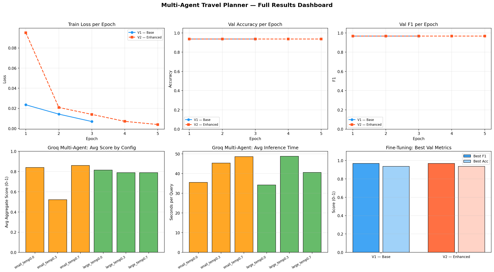
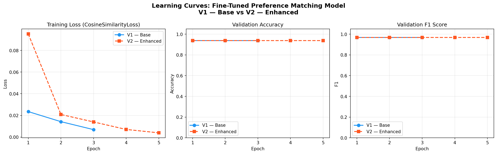

# Multi-Agent LLM Travel Planner (LangGraph + Groq Llama)

[](https://colab.research.google.com/github/AsserGharib1/MultiAgentTravelPlanner/blob/main/multi_agent_travel_planner.ipynb)
[](https://nbviewer.org/github/AsserGharib1/MultiAgentTravelPlanner/blob/main/multi_agent_travel_planner.ipynb)

A five-agent LLM system that turns a natural-language travel request (origin, destination, budget, days, preferences) into a grounded day-by-day itinerary, built on the **RealTravel** corpus of real POI data across **77 US cities**.

## Architecture

```
User query → Query Parser → [ Restaurant | Attraction | Accommodation ] (parallel search) → Planner → Itinerary
```

- Five cooperating agents orchestrated as a LangGraph state graph (`src/graph.py`, `src/agents/`).
- **Groq-hosted Llama 3.3 70B and 3.1 8B** with rate-limit back-off, retries, and fallback JSON parsing: engineered to stay under the free-tier 6,000 TPM limit.
- Recommendations grounded on **15,734 restaurants** and 9,000+ attractions plus accommodations from the RealTravel database.

## Evaluation: five-metric harness

| Metric | Type | Typical score |
|---|---|---|
| Budget feasibility | Rule-based | 1.000 |
| Constraint satisfaction (destination, days, cuisine, room type) | Rule-based | 1.000 |
| Preference alignment | Jaccard on likes/dislikes | 0.20 to 0.60 |
| Plan completeness | Rule-based (4 checks) | 1.000 |
| LLM-as-judge (relevance, quality, budget, preferences) | Llama, 1 to 5 scale | n/a |
| **Aggregate** | | **0.80 to 0.90** |

Plus hyperparameter experiments (model size × temperature) in `results/`, and a **fine-tuned MiniLM sentence transformer** for semantic preference matching.

## Evaluation results





## Repository contents

- `multi_agent_travel_planner.ipynb`: end-to-end walkthrough with preserved outputs.
- `src/`: agents, graph, prompts, data loading, evaluation, experiments. `final_nlp.py`, single-file variant.
- `results/`: experiment JSONs and dashboards.

## Setup

```bash
pip install -r requirements.txt
export GROQ_API_KEY="your_key"   # free at console.groq.com
```

## Data attribution

POI/user data: **RealTravel** dataset (not redistributed), building on the TravelPlanner benchmark and Google Local corpus, Xie et al., *TravelPlanner* (arXiv:2402.01622), Yan et al., *Personalized Showcases* (SIGIR 2023). All orchestration, evaluation, and fine-tuning code here is original.
